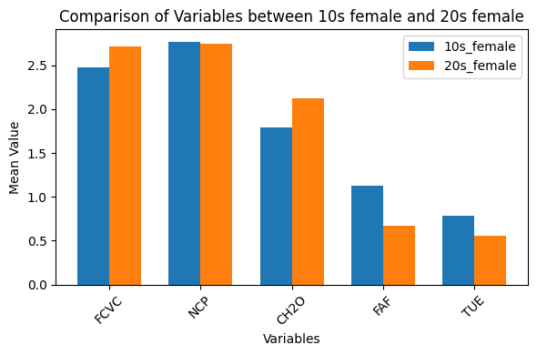
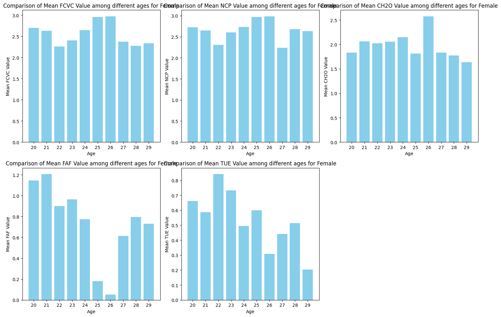

## [PROJECT_1] 호텔 리뷰 데이터를 활용한 분류 모델 개발
- 설명: 유저가 계좌 이용을 계속할지, 혹은 해지할지를 예측하는 이진 분류 Kaggle Competition
### 사용한 데이터셋
    - Binary Classification with a Bank Churn Dataset(Playground Series - Season 4, Episode 1)
### 날짜별 진행내용
#### 240128 : 데이터 탐색 및 시각화
- Json 형식 문자열 데이터를 각 칼럼으로 전개 (json_normalize 함수 이용)
- 텍스트 데이터를 word cloud로 시각화
- nltk stopwords를 이용해 불용어를 제거하고 핵심 단어 위주로 시각화
- nltk 라이브러리에서 opinion_lexicon을 이용해 감정 단어만 추출해 word cloud로 시각화
- langdetect의 detect 함수를 이용해 텍스트의 언어를 추출하고 영어로 된 데이터만 사용
- TfidfVectorizer를 이용해 의미없이 반복적으로 출현하는 단어를 제외하고 중요도가 높은 단어만 시각화
#### 240204 : 분류 모델 개발
#### 전처리
- 'text', 'ratings_overall'를 제외한 나머지 칼럼들 제거 및 [1.0,2.0,3.0]-> 'low, [4.0,5.0]->high로 라벨링
- sample을 이용해 라벨링 불균형 문제 해결 low 데이터 5000개 high 데이터 5000개로 sampling
- **토큰화** tensorflow.keras.preprocessing.text의 text_to_word_sequence를 이용해 토큰화
- nltk.corpus의 stopwords 이용해 불용어 제거 및 길이 3이상인 남어만 남김
- keras.preprocessing.sequence의 pad_sequences를 이용해 패딩처리

#### 임베딩 및 데이터셋 분리
- **Glove**의 6B embedding_size=100을 이용해 임베딩 처리
- **from gensim.models import Word2Vec**를 이용한 임베딩 처리
- **from gensim.models import FastText**를 이용한 임베딩 처리

#### **ML**LogisticRegression 모델 적용한 결과
- **Glove** 임베딩 처리 + LR model -> Validation Accuracy: 0.4886666666666667
- **Word2Vec** 임베딩 처리 + LR model -> Validation Accuracy: 0.7013333333333334
- **FastText**  임베딩 처리 + LR model -> Validation Accuracy: 0.7033333333333334

#### **DL**tf.keras.layers.Embedding 이용 + LSTM
|No.|maxlen|vocab_size|word_vector_dim|lstm_size|epoch|batch_size|결과|
|----|------|----------|---------------|----|-----|----------|----|
|1.|444|10000|16|8|10|128|loss: 0.8098 - accuracy: 0.5075|

#### **DL** Word2Vec 임베딩 + LSTM  

 

## [PROJECT_2] 심혈관계 데이터셋을 이용한 비만 위험도 예측 모델 개발
- 설명: Note: This dataset is particularly well suited for visualizations, clustering, and general EDA. Show off your skills!
### 사용한 데이터셋
    - Multi-Class Prediction of Obesity Risk
### 날짜별 진행내용
#### 240225 : 데이터 탐색 및 시각화
- 키와 몸무게를 이용한 BMI 지수 계산해서 기존의 NObeyesdad 비만도와 비교하기
- 카이제곱 검정과 cramer's v value를 통한 범주형 변수들간의 관계 파악하기 
- 성별, 가족이력, 나이대에 따른 비만도 분포 확인
- 10대, 20대 , 30대 남여 비만도 분포 확인
- 10대 여성과 20대 여성의 생활습관, 식습관 비교하기 

- 20대 여성(20~29)의 범주형, 숫자형 변수 비교하기 
